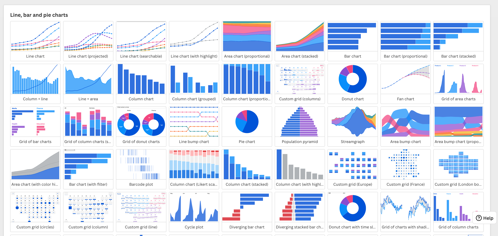
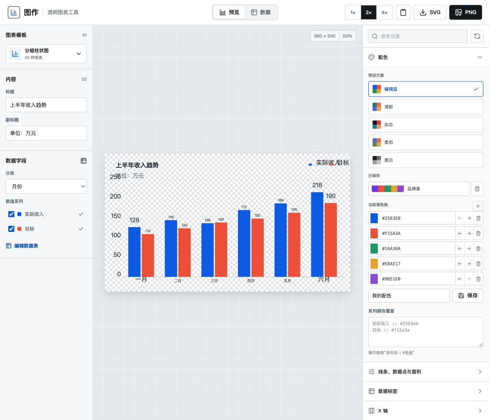
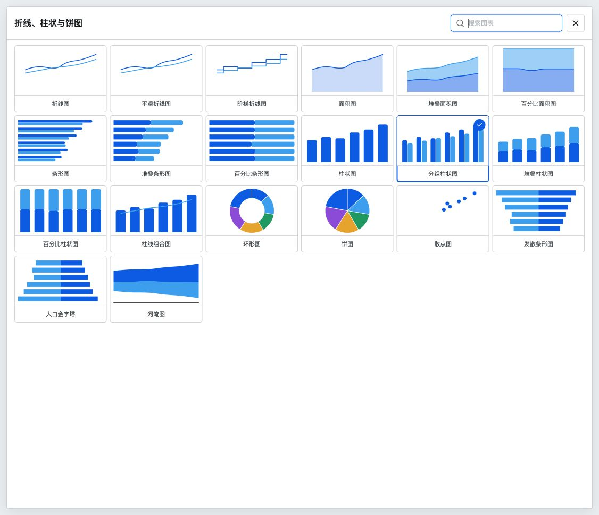
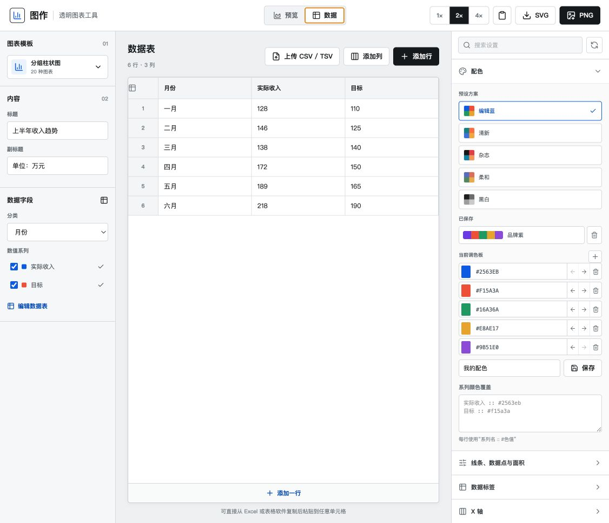

# 图作与 Flourish 的模板、功能和菜单差距调研

> 调研日期：2026-07-26  
> 调研对象：当前项目中的“图作”本地版本，以及 Flourish 官方公开帮助中心  
> 用途：为下一阶段的模板扩充、菜单重构、数据绑定和细节优化提供产品与技术依据

> 2026-08-09 注记：本文保留为早期差距调研，文内大量“20 个模板”的描述是历史口径。当前代码已经扩展到 30 个起始样式，完成模板注册表、每家族 renderer、字段角色绑定、模板校验、设置组动态显示、示例数据、行为回归测试和最小账号闭环。最新阶段判断见 `docs/project-stage-and-control.md`，部署说明见 `docs/deployment.md`。

## 1. 结论先行

当前“图作”已经具备一个透明图表导出工具的基本闭环：

- 可在 20 个图表起始样式之间切换；
- 可直接编辑表格、粘贴数据、上传 CSV/TSV；
- 支持主题配色、自定义配色、画布尺寸、背景与四周边距；
- 支持 SVG、PNG 以及 1x/2x/4x 导出；
- 已有标题、图例、坐标轴、标签、数字格式等常用配置。

但它与 Flourish 的主要差距不是“20 和 43”这个数字本身，而是以下四层：

1. **模板层级不同**  
   图作的 20 项主要是同一套通用渲染器的不同 `chartType`；Flourish 官方帮助中心目前至少记录了 **43 个独立模板家族**，每个家族有自己的数据结构、设置菜单和交互能力。

2. **菜单没有真正按模板变化**  
   图作大部分模板共用同一套右侧菜单，部分控件在某些模板中没有实际效果。Flourish 则把“通用设置”和“模板专属设置”分开，例如散点图有 X/Y/大小/颜色/形状/趋势线，Sankey 有源、目标、步骤、节点排序，地图有投影、区域、点、线和视口。

3. **数据字段只是被勾选，还没有被赋予角色**  
   图作目前主要通过“分类列 + 数值系列”驱动图表。组合图、散点图、人口金字塔等需要明确角色的图表，只能依赖列的勾选顺序推断，用户无法清楚指定“哪列是 X、哪列是 Y、哪列在左侧、哪列作为折线”。

4. **当前优先级应是做深，而不是立刻做满 43 类**  
   图作的核心定位是“快速生成可复用的透明图表图片”，无需复制 Flourish 的发布平台、团队协作和完整故事系统。更合理的目标是：先把现有 20 个起始样式收敛为 **7 个可靠的渲染家族**，建立模板专属字段与菜单，再扩展到 **12-15 个高质量模板家族、35-50 个起始样式**。

## 2. 数量口径：20 个起始样式不等于 20 个模板家族

### 2.1 当前图作

代码中定义了 20 个模板卡片，见 [`app/chart-model.ts`](../app/chart-model.ts#L150)。

| 口径 | 数量 | 说明 |
| --- | ---: | --- |
| 模板选择器中的卡片 | 20 | 用户可见的 20 个起始样式 |
| 当前内部渲染家族 | 约 7 | 折线/面积、柱条、组合、饼环、散点、发散/金字塔、河流 |
| 按 Flourish 的家族口径映射 | 约 2 | 19 项接近 Line/Bar/Pie 家族的起始点，1 项接近 Scatter 家族 |
| 独立模板数据结构 | 0 | 当前仍以“分类列 + 数值列”的通用结构为主 |
| 独立模板菜单定义 | 0 | 没有每个模板独立的字段、默认值、校验器和设置组声明 |

### 2.2 Flourish

按 Flourish 官方帮助中心的分类页计算，目前可核验到 **43 个模板家族**：

| 官方分类 | 家族数 | 代表模板 |
| --- | ---: | --- |
| Charts | 23 | Line/Bar/Pie、Scatter、Sankey、Hierarchy、Race、Survey |
| Maps | 6 | Projection map、Marker map、3D map、3D globe |
| Tables and heatmaps | 2 | Table、Heatmap |
| Content-based templates | 12 | Cards、Timeline、Quiz、Word cloud、3D viewer |
| **合计** | **43** | 不含每个家族内部的多个 starting points |

Flourish 没有在公开帮助中心给出一个稳定的“全部 starting points 卡片总数”。用户提供的 Line/Bar/Pie 模板选择器截图中，单这一家族就能看到 **至少 45 个起始样式**，页面底部仍未结束。因此：

- “图作 20 项 vs Flourish 43 家族”不能直接当作同一层级比较；
- Flourish 的总起始样式数量明显高于 43；
- 真正值得对齐的是“模板家族的数据模型和专属设置”，而不仅是选择器卡片数量。



## 3. 当前图作界面与工作流

### 3.1 已具备的完整工作流

当前图作已经覆盖：

1. 选择图表模板；
2. 编辑标题和副标题；
3. 选择分类字段和数值系列；
4. 在数据页直接编辑、增删和粘贴表格；
5. 设置主题色、自定义色板、透明/非透明背景；
6. 设置画布尺寸、边距、图例、坐标轴、数据标签；
7. 预览并导出 SVG/PNG。







### 3.2 当前菜单结构

图作右侧目前有 8 个通用设置区：

1. 配色；
2. 线条、数据点与面积；
3. 数据标签；
4. X 轴；
5. Y 轴；
6. 图例与交互；
7. 数字格式；
8. 画布与布局。

这套结构对折线、柱状等基础笛卡尔图表比较合适，但在饼图、散点图、发散图、人口金字塔和河流图中会出现两个问题：

- 菜单名称与图表语义不匹配，例如饼图仍展示 X/Y 轴；
- 控件可见但没有进入该模板的渲染逻辑，用户修改后看不到效果。

### 3.3 与 Flourish 的工作流差别

| 环节 | 图作 | Flourish | 差距 |
| --- | --- | --- | --- |
| 模板选择 | 20 张卡片，一层选择 | 家族 + 多个 starting points | 缺分类、搜索、最近使用、模板说明和数据要求 |
| 数据输入 | 通用表格 | 每个模板有专属 sheet 和 column bindings | 缺字段角色、必填/可选说明和模板级校验 |
| 自动识别 | 识别分类列和数值列 | 部分模板自动匹配 columns，仍允许明确绑定 | 图作无法理解 X/Y/size/color/source/target 等语义 |
| 设置菜单 | 大部分模板共用 8 组 | 共享设置 + 模板专属设置 | 无模板设置 schema，导致无效或误导控件 |
| 交互 | tooltip、图例等基础交互 | 筛选、搜索、选择、缩放、钻取、时间轴、故事视图 | 当前以静态导出为主 |
| 响应式 | 固定画布尺寸和缩放预览 | 桌面/平板/手机预览、断点与独立比例 | 可作为后续网页发布能力，而非首要导出能力 |
| 标注 | 标题、标签 | annotations、popups、panels、captions、highlights | 缺叙事性标注 |
| 输出 | SVG、PNG、复制 PNG | 发布、嵌入、图片、HTML、故事视频等 | 图作静态导出已形成差异化，不必全部追平 |
| 可访问性 | 暂无独立设置 | 屏幕阅读说明、可读内容、键盘/对比度等 | 建议至少补 alt description 和色盲检查 |
| 项目管理 | 浏览器当前状态为主 | 保存、复制、版本、发布、团队和权限 | 若继续本地工具定位，可先做本地项目文件保存 |

## 4. 图作 20 个模板逐项审计

### 4.1 折线与面积类

| 模板 | 当前数据解释 | 当前实现 | 主要问题 | 建议专属菜单 |
| --- | --- | --- | --- | --- |
| 折线图 | 分类 + 多数值列 | 多系列 line | 默认状态开启平滑，和“平滑折线图”边界重叠 | 线型、插值、点、缺失值、标签、预测区间 |
| 平滑折线图 | 分类 + 多数值列 | 强制平滑 | 平滑开关不能真正关闭，和普通折线只差默认值 | 平滑强度、单调性、点、线宽、末端标签 |
| 阶梯折线图 | 分类 + 多数值列 | `step=middle` | 仍可能叠加全局 smooth，语义冲突 | 阶梯位置 start/middle/end、点、缺失值 |
| 面积图 | 分类 + 数值列 | 只渲染第一个数值系列 | UI 可勾选多列，但额外列会被静默忽略 | 值系列单选、基线、面积透明度、线边界 |
| 堆叠面积图 | 分类 + 多数值列 | 堆叠 + 强制平滑 | 面积透明度存在下限，滑块部分区间无效果；缺堆叠顺序 | 堆叠顺序、缺失值、总量标签、线/面积独立透明度 |
| 百分比面积图 | 分类 + 多数值列 | 每行归一化至 0-100 | 使用绝对值汇总，混合正负数时含义可能错误 | 百分比规则、负值处理、100% 校验、百分比标签 |

### 4.2 柱状与条形类

| 模板 | 当前数据解释 | 当前实现 | 主要问题 | 建议专属菜单 |
| --- | --- | --- | --- | --- |
| 条形图 | 分类 + 多数值列 | 实际可渲染多系列水平分组条 | 名称暗示单系列，行为却是多系列；缺排序 | 系列模式、排序、条宽、圆角、基线、标签 |
| 堆叠条形图 | 分类 + 多数值列 | 水平 stack | 无堆叠顺序、总数标签、正负值策略 | 顺序、总计、段标签、正负分离、间距 |
| 百分比条形图 | 分类 + 多数值列 | 水平 100% stack | 空值和负值缺校验；绝对值归一化可能误导 | 归一化规则、百分比精度、空值、负值提示 |
| 柱状图 | 分类 + 数值列 | 只渲染第一个数值系列 | 多选数值列会被静默忽略 | 值系列单选、排序、柱宽、圆角、基线、标签 |
| 分组柱状图 | 分类 + 多数值列 | 多系列并列柱 | 系列顺序依赖勾选历史，没有显式排序 | 系列排序、组间距、组内间距、系列标签 |
| 堆叠柱状图 | 分类 + 多数值列 | 垂直 stack | 无顺序、总数、正负值策略 | 顺序、总计、段标签、正负分离 |
| 百分比柱状图 | 分类 + 多数值列 | 垂直 100% stack | 与百分比条形相同，缺校验和语义说明 | 归一化规则、精度、空值、负值提示 |

### 4.3 组合、比例和坐标类

| 模板 | 当前数据解释 | 当前实现 | 主要问题 | 建议专属菜单 |
| --- | --- | --- | --- | --- |
| 柱线组合图 | 分类 + 多数值列 | 第一个选中系列为柱，其余为线 | 没有“柱/线”角色映射、没有双 Y 轴；只有一列时只是柱状图 | 系列类型、左/右轴、单位、轴同步、线点设置 |
| 环形图 | 分类 + 第一数值列 | pie + 固定内半径 | 额外数值列被忽略；坐标轴、线条等菜单无意义 | 值列单选、内径、起始角、排序、标签和引导线 |
| 饼图 | 分类 + 第一数值列 | pie | 标签固定偏向分类 + 百分比，不能明确选原始值 | 值列、排序、角度、标签内容、引导线、其他项合并 |
| 散点图 | 第一数值列为 X，第二列为 Y | category 名称 + 数值点 | 无 X/Y 角色映射；只有一列时 X=Y；第三列以后忽略；点大小控件在菜单条件中不完整 | X、Y、size、color、shape、label、trend line、轴尺度 |

### 4.4 发散、金字塔和河流类

| 模板 | 当前数据解释 | 当前实现 | 主要问题 | 建议专属菜单 |
| --- | --- | --- | --- | --- |
| 发散条形图 | 第一数值列左、第二列右 | 左负右正的特殊分支 | 单列时两侧重复；无法指定左右角色；部分圆角、格式和范围控件无效 | 左值、右值、中线、对称轴、两侧标签和颜色 |
| 人口金字塔 | 第一数值列左、第二列右 | 与发散条形共享逻辑 | 没有年龄段、性别/群组校验；缺对称刻度和人口格式 | 年龄列、左右群组、对称范围、绝对值标签、总量 |
| 河流图 | 分类转成行号，多数值列 | 特殊 stream 分支 | 分类没有按真实时间解析；线/面积/透明度/标签/坐标和格式中的多项设置未接入 | 时间字段、堆叠顺序、中心线、平滑、标签、时间轴 |

### 4.5 跨模板问题

1. **没有模板级数据校验**  
   组合图、散点图、发散图至少需要明确的字段数量与角色，目前缺列时会降级成不易理解的结果。

2. **没有显式字段排序与角色映射**  
   多个特殊模板依赖 `seriesColumns` 的勾选顺序，用户无法看见或调整真实渲染顺序。

3. **部分控件“显示但无效”**  
   这是当前最需要修复的体验问题。菜单应该由模板能力决定，而不是先统一显示、再由渲染分支选择性忽略。

4. **横向图的 X/Y 轴语义容易误导**  
   条形图切换横向后，用户看到的 X/Y 菜单和实际数值轴/分类轴不一定一致。建议直接命名为“分类轴”和“数值轴”。

5. **自动测试没有覆盖控件效果**  
   当前测试可确认模板条目和页面关键词存在，但没有逐模板验证“修改某个配置后，生成的 option 和导出图确实变化”。

## 5. Flourish 43 个模板家族及其专属菜单

说明：

- 下表家族数量来自 Flourish 官方帮助中心分类页；
- “典型专属设置”基于各家族 overview 和 how-to 页面中明确出现的数据绑定、设置项和操作能力归纳；
- Flourish 会持续更新，菜单的精确英文名称可能变化，因此此处记录的是产品能力组，而不是逐字复刻界面；
- 对图作而言，表中的“建议优先级”按“透明图片导出工具”的定位评估，并非按 Flourish 的商业平台定位。

### 5.1 Charts：23 个家族

| # | Flourish 家族 | 专属数据绑定 | 典型专属设置与功能 | 图作现状 / 优先级 |
| ---: | --- | --- | --- | --- |
| 1 | [Line, bar and pie](https://helpcenter.flourish.studio/hc/en-us/articles/8761567940495-Line-bar-and-pie-charts-an-overview) | 标签/时间、多个系列、筛选/分面字段 | chart type、线/点/面积、轴、图例、标签、预测线、网格小图、组合图、时间滑块 | 图作主要覆盖对象；**P0 做深** |
| 2 | [Bar chart race](https://helpcenter.flourish.studio/hc/en-us/articles/8761566757647-Bar-chart-race-an-overview) | 实体 + 多时间阶段、图片、说明 | 最大可见条数、排序、时间轴、速度、暂停、图片、caption、轴高亮 | 未支持；P3 动画 |
| 3 | [Bubble chart](https://helpcenter.flourish.studio/hc/en-us/articles/8761547086735-Bubble-chart-An-overview) | 标签、大小、位置、颜色、图片 | 气泡布局/间距、大小/颜色/位置图例、图片、轴定位、高亮 | 未支持；**P2** |
| 4 | [Chord](https://helpcenter.flourish.studio/hc/en-us/articles/8761539049743-Chord-An-overview) | source、target、value | 有向/无向、弦、弧、排序、高亮、popup | 未支持；P3 |
| 5 | [Data explorer](https://helpcenter.flourish.studio/hc/en-us/articles/8761567730575-Data-explorer-an-overview) | 实体、类别/数值字段、地理点/区域 | packed circles、beeswarm、scatter、map、筛选和视图切换 | 未支持；P3 |
| 6 | [Draw the line](https://helpcenter.flourish.studio/hc/en-us/articles/8761560393487-Draw-the-line-chart-an-overview) | 可猜线、参考线、结果文案 | 初始可见比例、绘制交互、评分、结果反馈 | 未支持；非核心 |
| 7 | [Election results](https://helpcenter.flourish.studio/hc/en-us/articles/8761523017487-Election-results-chart-an-overview) | 党派、席位/票数、历史结果 | 门槛、联盟组合、历史对比、下拉/图例、翻译 | 未支持；垂直场景 |
| 8 | [Gantt](https://helpcenter.flourish.studio/hc/en-us/articles/8761546639375-Gantt-chart-an-overview) | 任务、开始、结束、分组 | 日期轴、任务样式、筛选、popup/panel | 未支持；P3 |
| 9 | [Gauge](https://helpcenter.flourish.studio/hc/en-us/articles/8761567109135-Gauge-an-overview) | 值、最小/最大、分组 | 形状、segments、ticks、needle、text、单图/网格 | 未支持；**P2，适合图标化导出** |
| 10 | [Hierarchy](https://helpcenter.flourish.studio/hc/en-us/articles/8761561023375-Hierarchy-an-overview) | 多层级、size、类别 | treemap/circle/sunburst/tree、depth、drilldown、层级 popup | 未支持；**P2** |
| 11 | [Line chart race](https://helpcenter.flourish.studio/hc/en-us/articles/8761547629711-Line-chart-race-an-overview) | 参与者 + 多阶段、图片、caption | scores/ranks、zoom/reveal、轴动画、时间和说明 | 未支持；P3 动画 |
| 12 | [Marimekko](https://helpcenter.flourish.studio/hc/en-us/articles/8761553749007-Marimekko-charts-an-overview) | 主指标、次指标、颜色/分面 | classic/bar Mekko、宽高双编码、排序、方向、百分比轴 | 未支持；P3 |
| 13 | [Network graph](https://helpcenter.flourish.studio/hc/en-us/articles/8761553784719-Network-graph-an-overview) | links、nodes、weight、group | classic/radial、有向/无向、节点大小/组、link strength | 未支持；P3 |
| 14 | [Parliament chart](https://helpcenter.flourish.studio/hc/en-us/articles/8761553852559-Parliament-chart-an-overview) | 党派、席位、变化 | 弧/行/席位、党派标签、席位变化、多数线 | 未支持；垂直场景 |
| 15 | [Pictogram](https://helpcenter.flourish.studio/hc/en-us/articles/8761540123407-Pictogram-an-overview) | category、subcategory、value、icon、color | 图标库/自定义 SVG path、方向、每图标数值、填充方式 | 未支持；**P2，适合图片导出** |
| 16 | [Radar](https://helpcenter.flourish.studio/hc/en-us/articles/8761575550351-Radar-an-overview) | 指标、系列、类别/筛选 | radar/star/radial bar、网格/组合、比较线、径向轴 | 未支持；**P2** |
| 17 | [Sankey](https://helpcenter.flourish.studio/hc/en-us/articles/8761554356879-Sankey-diagram-an-overview) | source、target、value、step | Sankey/alluvial、节点顺序、spread、筛选、分面、popup | 未支持；**P2/P3** |
| 18 | [Scatter plot](https://helpcenter.flourish.studio/hc/en-us/articles/8761582471439-Scatter-plot-an-overview) | X、Y、size、color、shape、time、filter | scatter/bubble/box/beeswarm/violin、趋势线、选择性标签、动画 | 图作只有基础点位；**P0 做深** |
| 19 | [Slope](https://helpcenter.flourish.studio/hc/en-us/articles/8761582577551-Slope-an-overview) | 实体 + 多期间 | 线/圆/曲线、scores/ranks/% change、highlight、标签避让 | 未独立支持；**P2** |
| 20 | [Sports](https://helpcenter.flourish.studio/hc/en-us/articles/8761554628367-Sports-an-overview) | 球员、位置、图片、信息 | 场地、阵型、自定义 X/Y、球员样式、动画 | 非核心 |
| 21 | [Sports race](https://helpcenter.flourish.studio/hc/en-us/articles/8761554645263-Sports-race-an-overview) | 参与者、时间/圈速、图片 | 赛道、自定义 SVG、镜头、圈/分段、奖牌、动画 | 非核心 |
| 22 | [Survey](https://helpcenter.flourish.studio/hc/en-us/articles/8761569396879-Survey-an-overview) | 每行一个受访者、题目、分组题 | dots/groups/bars/map/grid、controls、视图切换、story | 非核心 |
| 23 | [Tournament](https://helpcenter.flourish.studio/hc/en-us/articles/8761555017743-Tournament-an-overview) | matches、participants、round、winner、scores | 对阵树、轮次、移动导航、选手样式、故事高亮 | 非核心 |

### 5.2 Maps：6 个家族

| # | Flourish 家族 | 专属数据绑定 | 典型专属设置与功能 | 图作现状 / 优先级 |
| ---: | --- | --- | --- | --- |
| 24 | [Arc map](https://helpcenter.flourish.studio/hc/en-us/articles/8761566736015-Arc-map-an-overview) | source、destination、value、category、locations | 弧宽/色/透明度、地点、底图、inset、popup | 未支持；P3 |
| 25 | [Connections globe](https://helpcenter.flourish.studio/hc/en-us/articles/8761574167439-Connections-globe-An-overview) | locations + source/destination values | globe surface、旋转/缩放、箭头、筛选、story 焦点 | 未支持；P4 |
| 26 | [Marker map](https://helpcenter.flourish.studio/hc/en-us/articles/8761553766799-Marker-map-an-overview) | 经纬度/地点、图标/图片、类别、信息 | marker、emoji/icon/image、底图、起始视口、inset、popup | 未支持；P3 |
| 27 | [Projection map](https://helpcenter.flourish.studio/hc/en-us/articles/8761562464911-Projection-map-an-overview) | regions/geometry/points/lines 多 sheet | 40+ 投影、区域着色、点/尖峰/箭头/线、搜索、时间轴 | 未支持；P3 |
| 28 | [3D map](https://helpcenter.flourish.studio/hc/en-us/articles/8761538116879-3D-map-an-overview) | points、regions、lines、start/end time | 3D 视口、热力、挤出、脉冲、时间轴、镜头、counter | 未支持；P4 |
| 29 | [3D globe](https://helpcenter.flourish.studio/hc/en-us/articles/8761538098191-3D-globe-template-an-overview) | lat/lon、size、color、time、filter | globe style、lighting、camera、controls、timeline、popup | 未支持；P4 |

### 5.3 Tables and heatmaps：2 个家族

| # | Flourish 家族 | 专属数据绑定 | 典型专属设置与功能 | 图作现状 / 优先级 |
| ---: | --- | --- | --- | --- |
| 30 | [Table](https://helpcenter.flourish.studio/hc/en-us/articles/8761554867983-Table-an-overview) | 表格列、搜索/筛选字段 | 单元格/表头、列宽、手机模式、搜索、mini bar/line、着色、popup | 未支持；P3 |
| 31 | [Heatmap](https://helpcenter.flourish.studio/hc/en-us/articles/8761546958479-Heatmap-an-overview) | X、Y、value、filter、popup info | 分类/数值轴、分类/连续色板、筛选、controls、popup | 未支持；**P2** |

### 5.4 Content-based：12 个家族

| # | Flourish 家族 | 专属数据或内容 | 典型专属设置与功能 | 图作现状 / 优先级 |
| ---: | --- | --- | --- | --- |
| 32 | [Calculator](https://helpcenter.flourish.studio/hc/en-us/articles/8761547152783-Calculator-an-overview) | 输入项、变量、公式、结果 | 多种 input、Excel 类函数、结果模板、提交结果 | 非核心 |
| 33 | [Calendar](https://helpcenter.flourish.studio/hc/en-us/articles/10242475125007-Calendar-an-overview) | date、event、icon、filter、popup | 年/月/周、连续模式、locale、导航、单元格和图标 | 非核心 |
| 34 | [Cards](https://helpcenter.flourish.studio/hc/en-us/articles/8761573940879-Cards-an-overview) | 文本、图片、媒体、嵌入图表 | grid/carousel、hover/click、autoplay、HTML/CSS、筛选 | 非核心 |
| 35 | [Countdown](https://helpcenter.flourish.studio/hc/en-us/articles/8761561446543-Countdown-an-overview) | 目标日期/时间、结束文案 | count up/down、格式、图片、HTML | 非核心 |
| 36 | [Interactive SVG](https://helpcenter.flourish.studio/hc/en-us/articles/8761539216911-Interactive-SVG-An-overview) | SVG group/ID + 内容 | interactive/show all/accordion、click、CSS、嵌图 | 非核心 |
| 37 | [Number ticker](https://helpcenter.flourish.studio/hc/en-us/articles/8761548263823-Number-ticker-an-overview) | 数字、文本 | ticker、格式、字体、时长、HTML/Markdown | P3，可作数据卡片 |
| 38 | [Photo slider](https://helpcenter.flourish.studio/hc/en-us/articles/8761553867535-Photo-slider-an-overview) | 桌面/手机图片 | slide/fade/spotlight、起始位置、样式 | 非核心 |
| 39 | [Quiz](https://helpcenter.flourish.studio/hc/en-us/articles/8761554288783-Quiz-an-overview) | questions、feedback、result | 选择/滑块、计分、反馈、翻译、结果收集 | 非核心 |
| 40 | [Text annotator](https://helpcenter.flourish.studio/hc/en-us/articles/8761569636879-Text-annotator-an-overview) | 正文、annotation、identifier | side/inline、always/click、文本与批注样式、手机模式 | 非核心 |
| 41 | [Timeline](https://helpcenter.flourish.studio/hc/en-us/articles/8761582943759-Timeline-an-overview) | start/end、category、title、text、image | 横/竖、背景图、导航、可视窗口、手机适配 | P3 |
| 42 | [Word cloud](https://helpcenter.flourish.studio/hc/en-us/articles/8761569717647-Word-cloud-an-overview) | 原文或 word/frequency/category | 排除词、词数、词形处理、布局、尺度、动画、popup | P3 |
| 43 | [3D viewer](https://helpcenter.flourish.studio/hc/en-us/articles/8761538217615-3D-viewer-an-overview) | GLB/glTF/OBJ/FBX/ZIP 模型 | environment、lighting、background、camera、controls、story annotations | 非核心；模型上限 25 MB |

## 6. Flourish 的共享能力，图作需要选哪些

Flourish 的强大不只来自模板本身，还来自跨模板的共享平台能力。

| 共享能力 | Flourish | 图作建议 |
| --- | --- | --- |
| 配色 | 预设色板、自定义 palette、数值/分类色阶 | 已有基础；补系列级颜色、色阶、色盲检查 |
| 标题与页脚 | header/footer、字体、链接、来源 | 增加来源、注释和品牌角标即可 |
| Popups/panels | 自定义字段、HTML、点击/悬停 | 静态导出优先做“注释标签”，交互面板后置 |
| Annotations | 线、区域、文本、强调 | **P2，静态图片非常需要** |
| Controls/filters | 按钮、下拉、滑块、图例筛选 | 若继续以图片导出为主，可先不做复杂筛选 |
| Grids/small multiples | 按系列或类别拆成小图 | **P2，高价值且适合静态图片** |
| Data transforms | transpose、unpivot、merge、pivot | 先做“宽表/长表转换”和数字/日期识别 |
| Responsive preview | desktop/tablet/mobile/custom | 先保留画布尺寸；发布能力出现后再做断点 |
| Stories/scrollies | 多视图、动画、滚动叙事、音视频 | 不属于当前核心定位 |
| Accessibility | screen-reader description、可读内容 | 增加描述字段、对比度提示、键盘可操作 |
| Export/publish | 页面、embed、HTML、图片、故事视频 | 图作应继续突出透明 PNG/SVG 和本地使用 |
| AI Assistant | 调整样式/布局/可访问性，不直接改数据 | 后续可做“自然语言改样式”，但不是当前瓶颈 |

### 6.1 导出能力并非所有 Flourish 模板完全一致

Flourish 的“功能多”也伴随着模板和套餐限制，比较时不能只看导出按钮是否存在：

- 图片下载属于付费能力；
- SVG 只适用于基于 SVG 渲染的模板；
- 部分使用 WebGL 的 3D 或高性能模板不支持同样的图片导出；
- HTML 下载只向 Business、Enterprise 和部分旧套餐开放；
- 视频导出发生在 Story 层，是 premium 功能，单个 Story 最长 300 秒，当前导出不包含音频；
- 发布网页、响应式 embed 和故事播放是 Flourish 的平台优势，但不是图作当前必须复制的能力。

因此，图作在导出方向更适合坚持一个清楚的承诺：

> 所有被列为“静态图片模板”的家族，都必须稳定支持透明 PNG 和 SVG；如果某个渲染器无法输出 SVG，应在模板选择和导出区明确说明，而不是点击后才失败。

这会比追求完整发布平台更符合图作的使用场景，也可以形成比 Flourish 更简单、可预期的体验。

## 7. 推荐的菜单与模板架构

### 7.1 把菜单拆成“通用层 + 模板专属层”

建议所有模板保留以下通用菜单：

1. **内容**：标题、副标题、来源、注释；
2. **数据字段**：模板专属字段绑定与校验；
3. **配色**：主题、自定义色板、系列覆盖、色阶；
4. **画布**：透明/背景色、尺寸、四周边距、对齐；
5. **文字**：字体、字号、粗细、颜色；
6. **图例与提示**：只在模板支持时显示；
7. **数字与日期**：精度、千分位、单位、前后缀、日期格式；
8. **导出与可访问性**：倍率、格式、描述、对比度提示。

模板专属菜单按能力动态出现：

| 模板家族 | 应出现的专属菜单 |
| --- | --- |
| 折线/面积 | 线、点、面积、插值、缺失值、预测/强调 |
| 柱/条 | 方向、分组/堆叠、条宽、间距、排序、总计 |
| 组合图 | 每系列图型、左/右轴、单位、轴同步 |
| 饼/环 | 内径、角度、排序、标签、引导线、其他项 |
| 散点 | X、Y、size、color、shape、趋势线、点标签 |
| 发散/金字塔 | 左右字段、中线、对称轴、绝对值标签 |
| 河流 | 时间、堆叠顺序、中心线、平滑、时间标签 |
| 热力图 | X、Y、value、色阶、单元格、筛选 |
| 雷达 | 指标轴、范围、网格形状、填充、系列对比 |
| Sankey | source、target、value、step、节点顺序、间距 |

### 7.2 每个模板都需要声明自己的能力

下一阶段不要继续在一个大型 `buildChartOption` 中增加更多条件分支。建议为每个家族建立定义对象：

```ts
interface TemplateDefinition {
  id: string;
  family: string;
  startingPoints: StartingPoint[];
  dataBindings: DataBinding[];
  validators: DataValidator[];
  settingsGroups: SettingsGroup[];
  capabilities: {
    axes: boolean;
    legend: boolean;
    tooltip: boolean;
    labels: boolean;
    animation: boolean;
    svgExport: boolean;
  };
  buildOption(context: RenderContext): EChartsOption;
}
```

其中：

- `startingPoints` 只是同一家族的默认样式，不复制渲染逻辑；
- `dataBindings` 定义“分类、X、Y、大小、颜色、左值、右值”等角色；
- `validators` 在渲染前给出可读错误，而不是生成空白图；
- `settingsGroups` 决定右侧实际显示哪些菜单；
- `capabilities` 决定哪些共享功能和导出方式可用；
- `buildOption` 由家族级 renderer 实现。

### 7.3 选择器建议采用 Flourish 的“分类 + 缩略图”方式

模板选择器建议分两层：

1. 家族：折线与面积、柱与条、比例、关系、分布、流程、表格与热力；
2. 起始样式：每个家族内显示大缩略图、名称、适用场景和最小数据要求。

首版可增加：

- 搜索；
- 最近使用；
- 常用/推荐；
- 数据要求提示，例如“需要 1 个分类列 + 2 个数值列”；
- 不兼容数据时禁用并说明原因；
- 选择后保留能复用的标题、色板和画布设置，但重置不兼容的模板专属设置。

## 8. 建议路线图

### P0：先修正确性和菜单可信度

目标：用户看见的每个控件都有效，每个模板都能说明需要什么数据。

1. 建立 7 个家族级 `TemplateDefinition`；
2. 增加字段角色绑定，不再依赖勾选顺序；
3. 根据模板能力隐藏无效菜单；
4. 增加模板级数据校验和空状态；
5. 修复面积、散点、组合、发散、人口金字塔、河流中的静默忽略；
6. 为 20 个起始样式各增加一份示例数据和回归测试；
7. 测试配置变更是否真的改变 ECharts option 和导出结果。

### P1：把现有 20 个起始样式做深

1. 折线：缺失值、预测线、末端标签、强调区间；
2. 柱条：排序、总计、堆叠顺序、正负值、组间距；
3. 组合图：系列图型映射、双 Y 轴、单位；
4. 饼环：标签内容、内径、排序、起始角、其他项合并；
5. 散点：X/Y/size/color/shape、趋势线；
6. 发散/金字塔：左右角色、对称轴、绝对值标签；
7. 河流：真实日期字段和堆叠顺序。

### P2：扩展高价值静态模板

推荐优先顺序：

1. 热力图；
2. 雷达图；
3. 气泡图；
4. 仪表盘；
5. 坡度图；
6. 小多图；
7. 注释/强调层；
8. Pictogram；
9. Treemap/Hierarchy；
10. Sankey。

这批模板更适合“导出一张清晰透明图片”的核心任务，也能显著扩大使用场景。

### P3：按需求增加交互与平台能力

- 筛选器、时间滑块；
- popup/panel；
- 动画和 race；
- 响应式发布；
- 本地项目保存、历史版本；
- 网页嵌入；
- 地图和表格。

### P4：暂不建议投入

- 3D map、3D globe、3D viewer；
- Survey、Quiz、Calculator；
- Sports、Sports race、Tournament；
- 完整 story/scrollytelling；
- 团队权限与企业发布能力。

这些能力实现成本高，且与“透明图表图片生成器”的当前定位较远。

## 9. 下一阶段建议目标

建议不要把目标写成“复制 Flourish 的 43 个模板”，而改成：

> 在保持图作快速、轻量、本地和透明导出的前提下，完成 12-15 个可靠模板家族、35-50 个高质量起始样式；每个家族拥有独立的数据字段、校验、菜单和示例，所有可见控件都能真实影响预览与导出。

可量化验收标准：

| 指标 | 建议目标 |
| --- | ---: |
| 可靠模板家族 | 12-15 |
| 起始样式 | 35-50 |
| 每个模板示例数据 | 100% |
| 必填字段校验覆盖 | 100% |
| 可见但无效的控件 | 0 |
| 每个设置组的行为测试 | 至少 1 个 |
| PNG/SVG 基础导出回归 | 100% 家族覆盖 |
| 数据修改后成功重绘 | 100% 家族覆盖 |
| 空值、文本、负值和极端值用例 | 每家族至少 1 组 |

## 10. 推荐的第一轮任务清单

1. 创建模板定义层，先迁移“柱/条”和“饼/环”两个家族；
2. 左侧“数据字段”改成模板角色绑定；
3. 右侧菜单改为按 `settingsGroups` 生成；
4. 为饼/环隐藏坐标轴，为散点显示 X/Y/点设置；
5. 为组合图增加柱/线和左/右轴映射；
6. 为发散/金字塔增加左右字段映射；
7. 修复河流图的日期/时间解释；
8. 给 20 个起始样式补齐示例、错误提示和回归测试；
9. 完成后再增加热力图、雷达图和气泡图。

这一轮完成后，图作的模板数量仍可能是 20，但产品质量会发生结构性变化：模板不再只是缩略图和条件分支，而会真正拥有自己的数据规则、菜单和行为。

## 11. 调研依据与限制

### 11.1 本地依据

- [`app/chart-model.ts`](../app/chart-model.ts)：模板列表、配置结构和 ECharts option 构建；
- [`app/page.tsx`](../app/page.tsx)：模板选择、数据编辑、字段选择和右侧设置；
- [`tests/rendered-html.test.mjs`](../tests/rendered-html.test.mjs)：当前页面和模板条目测试；
- 本文第 3 节中的当前产品截图；
- 用户提供的 Flourish 模板选择器截图。

### 11.2 Flourish 官方分类与共享能力

- [Flourish Help Center](https://helpcenter.flourish.studio/hc/en-us)
- [Charts](https://helpcenter.flourish.studio/hc/en-us/categories/8636109131791-Charts)
- [Maps](https://helpcenter.flourish.studio/hc/en-us/categories/8825239695759-Maps)
- [Tables and heatmaps](https://helpcenter.flourish.studio/hc/en-us/categories/12984386242703-Tables-and-heatmaps)
- [Content-based templates](https://helpcenter.flourish.studio/hc/en-us/categories/12984403849615-Content-based-templates)
- [Shared settings](https://helpcenter.flourish.studio/hc/en-us/categories/8825222133519-Shared-settings)
- [Data](https://helpcenter.flourish.studio/hc/en-us/categories/8825238479631-Data)
- [Stories and scrollies](https://helpcenter.flourish.studio/hc/en-us/categories/12984335680911-Stories-and-scrollies)
- [Adding data to a template](https://helpcenter.flourish.studio/hc/en-us/articles/8761545383183-Adding-data-to-a-template)
- [Exporting, publishing, embedding and sharing](https://helpcenter.flourish.studio/hc/en-us/articles/8761565550607-Exporting-publishing-embedding-and-sharing)
- [Understanding image download options](https://helpcenter.flourish.studio/hc/en-us/articles/8761545595791-Understanding-image-download-options)
- [Downloading stories as video](https://helpcenter.flourish.studio/hc/en-us/articles/8761520453903-How-to-download-your-stories-as-a-video)
- [Creating mobile-friendly visualizations](https://helpcenter.flourish.studio/hc/en-us/articles/8761567966351-How-to-create-mobile-friendly-visualizations)
- [Adding a screen-reader description](https://helpcenter.flourish.studio/hc/en-us/articles/8761537418383-How-to-add-a-screen-reader-description)
- [Flourish Assistant](https://helpcenter.flourish.studio/hc/en-us/articles/16681550872719-Flourish-Assistant-an-overview)

### 11.3 限制

- 本文不是对 Flourish 私有代码、付费后台或所有实时菜单的逆向分析；
- 43 是官方帮助中心当前记录的模板家族数，不等于全部 starting points 数；
- 起始样式会持续新增或调整，因此截图中的卡片数量只作为“至少可见数量”；
- 某些菜单名称来自官方 overview/how-to 页面中的能力归纳，实际界面文字可能随版本变化；
- 本文目的是帮助图作确定下一步产品边界，不建议逐像素或逐功能复制 Flourish。
